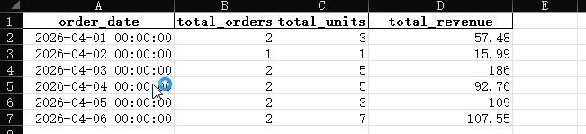
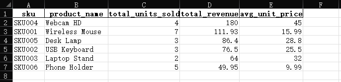
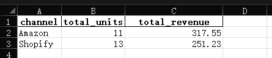

Automatically generate clean, structured sales reports from raw CSV data.

## 🚀 What this does

- Merge and clean messy order data
- Generate daily sales summary
- Analyze product (SKU) performance
- Analyze sales channels
- Detect low inventory risks
- Export everything into a ready-to-use Excel report

---

## 📈 Example Output

### Daily Sales Summary


### SKU Analysis


### Inventory Alerts


---

## 🧠 Use Case

This is useful for:

- Shopify sellers
- Amazon sellers
- Small eCommerce businesses
- Anyone managing orders in CSV/Excel

---

## ⚙️ How to run

```bash
pip install -r requirements.txt
python src/main.py
📦 Input
orders_sample.csv
inventory_sample.csv
📤 Output
sales_report.xlsx
💡 What problem it solves

Instead of manually cleaning Excel data every day,
this script automates the entire reporting process.

🧩 Customization

Can be adapted for:

different CSV formats
different business rules
automated reporting workflows